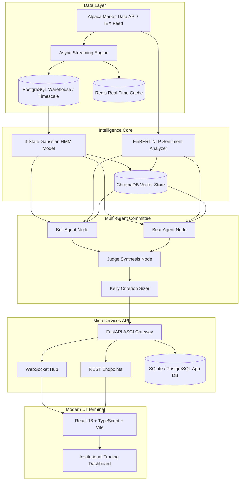

# MarketPulse AI - Architecture, Mathematical Formulations, & Deployment Guide

## 1. System Architecture Diagram



---

## 2. Mathematical & Quantitative Formulations

### A. Gaussian Hidden Markov Model (HMM)
The market return dynamics are modeled as a discrete-time Markov chain with 3 hidden states $S_t \in \{0: \text{Bull}, 1: \text{Bear}, 2: \text{Sideways}\}$:

$$\mathbf{y}_t \mid (S_t = k) \sim \mathcal{N}(\boldsymbol{\mu}_k, \boldsymbol{\Sigma}_k)$$

Where the observation vector $\mathbf{y}_t$ contains:
1. Log Returns: $r_t = \ln(P_t / P_{t-1})$
2. Realized Volatility: $\sigma_t = \sqrt{\frac{1}{N}\sum_{i=1}^N (r_{t-i} - \bar{r})^2}$
3. Volume Anomaly Scale: $v_t = (V_t - \text{SMA}_{20}(V_t)) / \sigma(V_t)$

The transition probability between hidden states is parameterized by the transition matrix $A$:
$$A_{ij} = P(S_{t+1} = j \mid S_t = i)$$

### B. FinBERT Sentiment Polarity
News article bodies and headlines are encoded using the FinBERT transformer model:
$$S_{\text{article}} = P(\text{Positive}) - P(\text{Negative}) \in [-1.0, +1.0]$$

### C. Multi-Agent Disagreement Metric
The cognitive divergence between the Bull and Bear agents is measured by:
$$\delta_{\text{disagreement}} = \frac{1}{2} \left| \text{Score}_{\text{bull}} - \text{Score}_{\text{bear}} \right| \in [0.0, 1.0]$$

### D. Kelly Criterion Position Sizing
Position sizes are computed based on historical win rates $W$, win-loss ratio $R$, and fractional Kelly multiplier $c_{\text{risk}}$:

$$f^* = c_{\text{risk}} \times \frac{W \cdot R - (1 - W)}{R}$$

Where $c_{\text{risk}} \in \{0.25 \text{ (Conservative)}, 0.50 \text{ (Moderate)}, 0.75 \text{ (Aggressive)}\}$.

---

## 3. Production Deployment Guide

### Option 1: Docker Compose (Recommended)
To spin up the entire production stack including PostgreSQL, Redis, FastAPI backend, and React Nginx frontend:

```bash
docker-compose up --build -d
```

Services will be accessible at:
- **Web Terminal:** `http://localhost:3000`
- **REST & WS API:** `http://localhost:8000`
- **PostgreSQL Port:** `localhost:5433`
- **Redis Port:** `localhost:6379`

### Option 2: Local Development Setup

#### 1. Backend Microservice
```bash
# Activate virtualenv
.\venv\Scripts\Activate.ps1

# Install requirements
pip install -r marketpulse_backend/requirements.txt
pip install fastapi uvicorn pydantic-settings sqlalchemy aiosqlite passlib bcrypt python-multipart pyjwt email-validator pytest pytest-asyncio httpx

# Start FastAPI server
uvicorn marketpulse_api.main:app --reload --host 127.0.0.1 --port 8000
```

#### 2. Frontend Development Server
```bash
cd frontend
npm install
npm run dev
```

---

## 4. Database Schema & Migration Strategy

MarketPulse uses SQLAlchemy Async ORM with automatic schema bootstrapping and fallback support:
- In development/testing environments, it automatically creates and manages SQLite schema in `marketpulse.db`.
- In production containers, it connects to PostgreSQL with partition tables on `created_at` for high-volume market tick data.

### Seeded Institutional Demo Accounts:
- `demo@marketpulse.ai` / `password123` (Institutional Trader)
- `retail@marketpulse.ai` / `password123` (Retail Trader)
- `admin@marketpulse.ai` / `password123` (System Administrator)
